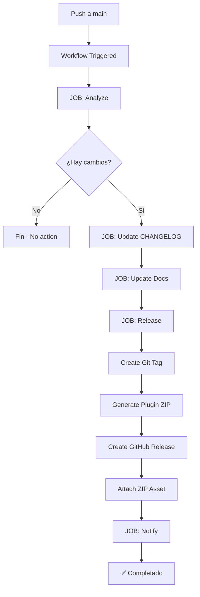

# 📦 Sistema de Automatización de Releases y Documentación

Este documento describe el sistema de automatización completo para gestionar releases y documentación del plugin WordPress Feature API.

---

## 📋 Tabla de Contenidos

1. [Visión General](#visión-general)
2. [Estructura del Workflow](#estructura-del-workflow)
3. [Convenciones de Commits](#convenciones-de-commits)
4. [Archivos Generados](#archivos-generados)
5. [Configuración](#configuración)
6. [Ejemplos de Uso](#ejemplos-de-uso)

---

## 🔭 Visión General

El sistema automatiza completamente el proceso de release:

```
┌─────────────────────────────────────────────────────────────────────────────┐
│                           TRIGGER: push/merge a main                       │
└─────────────────────────────────────┬───────────────────────────────────────┘
                                      ▼
┌─────────────────────────────────────────────────────────────────────────────┐
│                         JOB: ANALYZE (Análisis)                            │
│  ┌─────────────────┐  ┌──────────────────┐  ┌──────────────────────────┐   │
│  │ Extraer versión │  │ Clasificar       │  │ Generar changelog        │   │
│  │ desde PHP       │  │ commits          │  │ entries                  │   │
│  └─────────────────┘  └──────────────────┘  └──────────────────────────┘   │
└─────────────────────────────────────┬───────────────────────────────────────┘
                                      │
                    ┌─────────────────┼─────────────────┐
                    ▼                 ▼                 ▼
┌───────────────────────┐ ┌───────────────────┐ ┌─────────────────────────┐
│ JOB: UPDATE_CHANGELOG │ │ JOB: UPDATE_DOCS  │ │ JOB: RELEASE            │
│                       │ │                   │ │                         │
│ - Lee CHANGELOG.md    │ │ - Crea docs/       │ │ - Crea tag Git          │
│ - Inserta nueva entry │ │   releases/v*.md   │ │ - Genera ZIP plugin     │
│ - Commit cambios      │ │ - Actualiza README │ │ - Crea GitHub Release   │
│                       │ │ - UPGRADING.md si  │ │ - Adjunta ZIP           │
│                       │ │   breaking changes │ │                         │
└───────────────────────┘ └───────────────────┘ └─────────────────────────┘
```

---

## 🏗️ Estructura del Workflow

### **Archivo Principal:** `.github/workflows/release-and-docs.yml`

#### **Jobs y sus Responsabilidades:**

| Job | Propósito | Salidas |
|-----|-----------|---------|
| `analyze` | Analiza commits y extrae versión | `version`, `changelog_content`, `has_changes` |
| `update_changelog` | Actualiza CHANGELOG.md | Commits el changelog |
| `update_docs` | Genera documentación técnica | Archivos en `docs/releases/` |
| `release` | Crea tag, ZIP y GitHub Release | Tag, ZIP, Release |
| `notify_new_features` | Notifica nuevas funcionalidades | Log de nuevas features |

---

## 📝 Convenciones de Commits

El sistema clasifica automáticamente los commits según sus prefijos:

### **Prefijos Soportados:**

| Prefijo | Clasificación | Ejemplo |
|---------|---------------|---------|
| `feat:` / `feat` / `added` / `add` / `new` | ✨ **Added** | `feat: add new REST endpoint` |
| `fix:` / `fixed` / `bugfix` | 🐛 **Fixed** | `fix: resolve caching issue` |
| `change:` / `changed` / `update:` | 🔄 **Changed** | `change: update API signature` |
| `breaking:` / BREAKING en body | ⚠️ **Breaking** | `breaking: change API structure` |
| Otros | 📝 **Changed** | `docs: update README` |

### **Ejemplos de Commits:**

```bash
# ✅ Buenos ejemplos
feat: add new WP_Feature::execute() method
feat: add client-side feature registration
fix: resolve permission callback issue
fix: correct REST endpoint routing
breaking: drop PHP 7.2 support
docs: update API documentation
refactor: improve feature registry performance

# ❌ Evitar
Update file
Fix stuff
Added something
```

---

## 📁 Archivos Generados

### **CHANGELOG.md**

```markdown
# Changelog

All notable changes to this project will be documented in this file.

The format is based on [Keep a Changelog](https://keepachangelog.com/en/1.0.0/),
and this project adheres to [Semantic Versioning](https://semver.org/spec/v2.0.0.html).

## [Unreleased]

## [0.1.8] - 2024-01-15

### ✨ Added
- Add new REST API endpoint ([abc123](https://github.com/...))
- Client-side feature registration ([def456](https://github.com/...))

### 🐛 Fixed
- Resolve permission callback issue ([ghi789](https://github.com/...))

### ⚠️ Breaking Changes
- Drop PHP 7.2 support ([jkl012](https://github.com/...))
```

### **Documentación de Release** (`docs/releases/0.1.8.md`)

```markdown
---
title: Release 0.1.8
sidebar_label: v0.1.8
description: Changes and improvements in version 0.1.8
---

# Release 0.1.8

**Fecha:** 2024-01-15  
**Versión:** 0.1.8

## Resumen de Cambios

| Tipo | Cantidad |
|------|----------|
| Nuevas funcionalidades | 2 |
| Cambios | 1 |
| Correcciones | 1 |

## Detalle de Cambios

[Contenido del changelog...]

## Actualización

\`\`\`bash
composer require automattic/wp-feature-api:0.1.8
\`\`\`
```

### **UPGRADING.md** (solo con breaking changes)

```markdown
# Upgrade Guide

This document contains breaking changes and migration guides for major versions.

## Table of Contents

---

## Upgrading to 0.1.8

### Breaking Changes

- Drop PHP 7.2 support ([abc123](https://github.com/...))

### Migration Steps

1. Review the breaking changes listed above
2. Test the upgrade in a staging environment
3. Update your code as needed
4. Deploy to production
```

---

## ⚙️ Configuración

### **Variables de Entorno:**

| Variable | Valor | Descripción |
|----------|-------|-------------|
| `PLUGIN_MAIN_FILE` | `wp-feature-api.php` | Archivo principal con cabecera `Version:` |
| `PLUGIN_SLUG` | `wp-feature-api` | Slug del plugin (nombre del ZIP) |
| `PLUGIN_NAME` | `WordPress Feature API` | Nombre para display |

### **Personalización de Paths:**

```yaml
# En release-and-docs.yml
env:
  PLUGIN_MAIN_FILE: wp-feature-api.php  # Cambiar si es diferente
  PLUGIN_SLUG: wp-feature-api           # Cambiar al slug del plugin
```

---

## 🚀 Ejemplos de Uso

### **Scenario 1: Nueva Feature**

```bash
# Crear commit con nueva funcionalidad
git commit -m "feat: add AI integration module

- Add OpenAI API client
- Add prompt templates
- Add response caching"
```

**Resultado:**
- Nueva entrada en `docs/releases/0.1.9.md`
- Categorizado como **✨ Added**
- Añadido a CHANGELOG.md

### **Scenario 2: Corrección de Bug**

```bash
# Corregir bug y documentar
git commit -m "fix: resolve REST API authentication bypass

The permission callback was not properly checking
capabilities for non-authenticated users.

Closes #123"
```

**Resultado:**
- Categorizado como **🐛 Fixed**
- Incluido en changelog con enlace al commit

### **Scenario 3: Breaking Change**

```bash
# Anunciar cambio rupturista
git commit -m "breaking: drop PHP 7.x support

This version requires PHP 8.0+.
The minimum WordPress version is now 6.4.

Migration guide: See UPGRADING.md"
```

**Resultado:**
- Categorizado como **⚠️ Breaking Changes**
- Creada/actualizada sección en `UPGRADING.md`
- Añadida nota en release de GitHub

---

## 📊 Flujo de Trabajo Completo



---

## 🛠️ Mantenimiento

### **Actualizar Versión:**

La versión se lee automáticamente del archivo principal:

```php
/**
 * Plugin Name: WordPress Feature API
 * Version: 0.1.8  <-- Solo cambia esto
 */
```

### **Verificar Workflow:**

```bash
# Simular análisis de commits
git log --oneline --all --decorate

# Ver tags existentes
git tag -l

# Ver último tag
git describe --tags --abbrev=0
```

---

## 📚 Recursos Adicionales

- [Keep a Changelog](https://keepachangelog.com/en/1.0.0/)
- [Semantic Versioning](https://semver.org/)
- [GitHub Actions Documentation](https://docs.github.com/en/actions)

---

*Sistema de automatización creado para el proyecto WordPress Feature API.*

